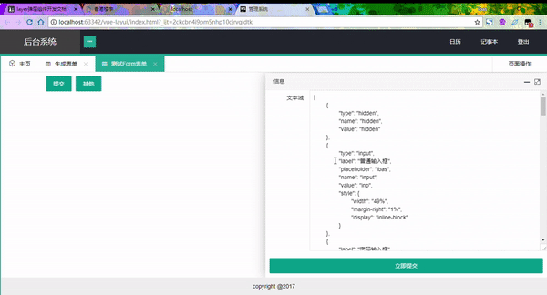

# vue-layui
[demo](http://www.sunibas.cn/files/vue-layui/)

#### api 文档编写在 demo 中，另外更为详细的说明信息可见脚本内容

#### 最近在编码另一个项目，这个项目本来会有一个使用工具，但是时间不足一直没有进行，最近正在编写工具
[工具](https://github.com/IBAS0742/rewrite_project/tree/master/vue-electron)

<video id="video" controls="" preload="true“>
    <source id="mp4" src="./video/usage.mp4" type="video/mp4">
</video>

- 配置 表单项 地址 [http://www.sunibas.cn/files/vue-layui/page/function/editLayerVueAttr.html](http://www.sunibas.cn/files/vue-layui/page/function/editLayerVueAttr.html)

